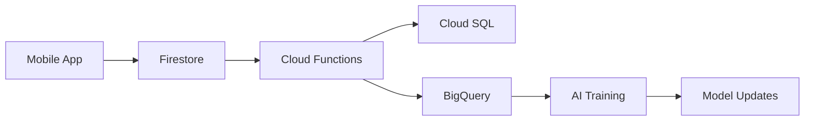

# 📁 Database 구조 가이드

## 🏗️ 전체 데이터베이스 아키텍처

Senior_MHealth 프로젝트는 용도별로 데이터베이스 폴더가 분리되어 있습니다.

### 1️⃣ 운영 데이터베이스 (`/database/`)
**위치**: `/database/`
**용도**: Frontend와 Backend Functions의 실시간 운영 데이터
**담당**: Frontend팀, Backend Functions팀

```
database/
├── firestore/        # 실시간 NoSQL 데이터
│   ├── collections/  # TypeScript 컬렉션 정의
│   ├── schema.ts     # 스키마 정의
│   └── rules.rules   # 보안 규칙
│
├── cloud-sql/        # PostgreSQL 관계형 데이터
│   ├── schema.sql    # 테이블 스키마
│   ├── migrations/   # 마이그레이션 스크립트
│   └── models/       # TypeScript 모델
│
└── bigquery/         # (문서만) 실제 스키마는 backend/database에
    └── README.md
```

#### 사용처:
- `backend/functions/src/controllers/*.ts`
- `backend/functions/src/services/*.ts`
- `frontend/web/lib/firebase/*.ts`

### 2️⃣ AI/ML 데이터베이스 (`/backend/database/`)
**위치**: `/backend/database/`
**용도**: AI 서비스 전용 BigQuery 데이터 웨어하우스
**담당**: AI팀

```
backend/database/
└── schemas/
    ├── bigquery_schemas.sql      # BigQuery 테이블 정의
    │   ├── labeled_data          # 레이블링된 학습 데이터
    │   ├── quality_metrics       # 품질 메트릭
    │   ├── expert_performance    # 전문가 성과
    │   ├── model_performance     # 모델 성능
    │   └── clinical_outcomes     # 임상 결과
    │
    └── labeled_data_schema.py    # Python 스키마 클래스
```

#### 사용처:
- `backend/functions/labeling_pipeline_trigger.py`
- `backend/ai-service/` (향후 연동 예정)
- BigQuery 콘솔에서 직접 실행

## 🔄 데이터 흐름



## ⚠️ 중요 사항

### 파일 이동 금지!
현재 구조에서 파일을 이동하면 다음 의존성이 깨집니다:
- `backend/functions/labeling_pipeline_trigger.py` → `labeled_data_schema.py`

### 향후 통합 계획
Phase 5 (운영 최적화 단계)에서 다음과 같이 통합 예정:
1. 모든 BigQuery 스키마를 `/database/bigquery/`로 이동
2. Import 경로 일괄 수정
3. CI/CD 파이프라인 업데이트

## 📊 데이터베이스별 특징

| 데이터베이스 | 용도 | 데이터 타입 | 접근 패턴 | 위치 |
|------------|------|------------|----------|------|
| Firestore | 실시간 운영 | 사용자, 세션, 분석결과 | 실시간 R/W | `/database/firestore/` |
| Cloud SQL | 관계형 데이터 | 사용자, 조직, 권한 | 트랜잭션 | `/database/cloud-sql/` |
| BigQuery | 데이터 분석 | 학습데이터, 메트릭 | 배치 분석 | `/backend/database/schemas/` |

## 🛠️ 관리 가이드

### Firestore 스키마 변경
1. `/database/firestore/schema.ts` 수정
2. TypeScript 타입 재생성
3. Frontend/Functions 테스트

### Cloud SQL 스키마 변경
1. `/database/cloud-sql/migrations/` 새 마이그레이션 추가
2. 마이그레이션 실행
3. `/database/cloud-sql/models/` TypeScript 모델 업데이트

### BigQuery 스키마 변경
1. `/backend/database/schemas/bigquery_schemas.sql` 수정
2. BigQuery 콘솔에서 실행
3. Python 스키마 동기화 (`labeled_data_schema.py`)

## 📝 체크리스트

데이터베이스 작업 시 확인사항:
- [ ] 올바른 폴더에서 작업하고 있는가?
- [ ] 의존성을 확인했는가?
- [ ] 마이그레이션이 필요한가?
- [ ] 타입 정의가 동기화되어 있는가?
- [ ] 문서를 업데이트했는가?

---
작성일: 2024.12.20
담당: AI/Backend 통합팀